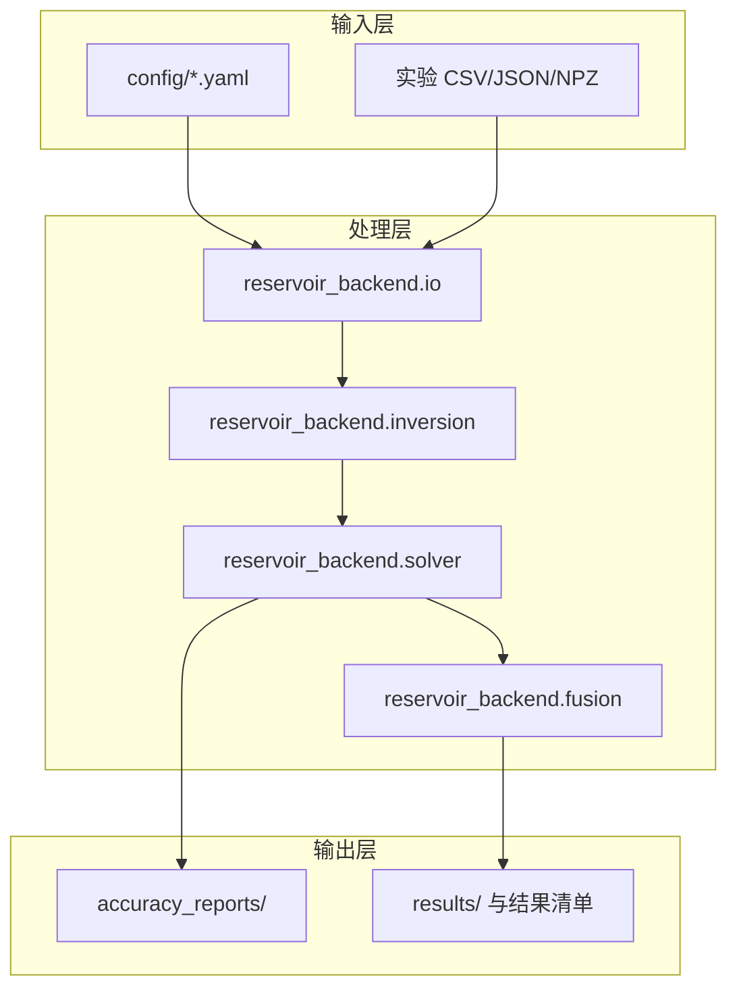

# 架构概览

本文说明仓库结构、主数据流与模块关系。读完本文你将了解代码如何组织、数据如何流转，以及各子系统的边界。

**下一步阅读：** [API_AND_DATA_CONTRACT.md](API_AND_DATA_CONTRACT.md)（接口与数据格式）、[numerical_methods.md](numerical_methods.md)（数值方法细节）。

模块成熟度见 [../STATUS.md](../STATUS.md)。

## 仓库目录

| 路径 | 职责 |
|------|------|
| `reservoir_backend/` | 可安装 Python 包：核心数据结构、数值内核、反演、融合、跨尺度、工作流、结果契约、IO、CLI |
| `config/` | YAML 案例定义 |
| `scripts/` | CLI 包装脚本、验证运行器与文档一致性检查 |
| `examples/` | 可运行演示（完整管线、Archie、压力、多信号） |
| `benchmarks/` | 独立基准脚本 |
| `harness/` | 验证与性能分析工具 |
| `tests/` | Pytest 套件与回归参考数据 |
| `docs/` | 文档 |
| `specs/` | 设计规格与需求追溯 |
| `accuracy_reports/` | 生成的基准/验证 JSON 与 Markdown 摘要 |

运行时输出目录（通常被 git 忽略）：`results/`、`validation_reports/`、`profiling_reports/`。  
注意：根目录 `results/` **仅存放案例运行产物**；结果契约源码在 `reservoir_backend/results/`，二者不要混放。

开源参考材料以 **git submodule** 放在 `references/upstream/`（只读 deck/示例）。**禁止** `import` 上游代码；仅用 `pathlib` 或 `load_structured_deck` 读文件。详见 [../references/README.md](../references/README.md)。

## 包内模块

| 模块 | 路径 | 职责 |
|------|------|------|
| core | `reservoir_backend/core/` | `Grid3D`、`Field3D`、单位、井、状态、异常 |
| solver | `reservoir_backend/solver/` | 压力、输运、毛细管/重力、三相与诊断等数值内核 |
| results | `reservoir_backend/results/` | 结果清单、目录、导出与报告索引（文件契约层） |
| data | `reservoir_backend/data/` | 实验 CSV/JSON/NPZ 摄入、模式、QC |
| field_data | `reservoir_backend/field_data/` | 井表、生产/压力历史、属性场 |
| inversion | `reservoir_backend/inversion/` | Archie、电磁、声学、多信号饱和度融合 |
| simulation | `reservoir_backend/simulation/` | IMPES 顺序循环、生产汇总 |
| fusion | `reservoir_backend/fusion/` | 场融合、不确定性、克里金、合成孪生 |
| cross_scale | `reservoir_backend/cross_scale/` | 相似性、尺度效应、曲线对比、升尺度报告 |
| workflow | `reservoir_backend/workflow/` | 工业案例工作流 v0 |
| project | `reservoir_backend/project/` | 项目/案例/运行文件注册 |
| schedule | `reservoir_backend/schedule/` | 多井调度模型 v0 |
| history_matching | `reservoir_backend/history_matching/` | 合成孪生历史拟合原型 |
| io | `reservoir_backend/io/` | 配置加载、结果管理、写入器、自研结构化 deck 子集读取 |
| api | `reservoir_backend/api/` | UDP 最小实现与预留 REST 门面 |
| cli | `reservoir_backend/cli/` | YAML 驱动案例运行器 |
| performance | `reservoir_backend/performance/` | 性能分析器与基线报告 |

### solver 与 results 说明

数值内核位于 `reservoir_backend/solver/`，统一以 `reservoir_backend.solver.*` 导入（例如 `reservoir_backend.solver.pressure_solver`）。主要组件包括：压力求解、传导率、速度、相渗、饱和度输运、毛细管/重力通量、CFL/限制器/TVD、三相输运及诊断报告模块。

结果契约层位于 `reservoir_backend/results/`，统一以 `reservoir_backend.results.*` 导入（清单、目录、导出与报告路径索引）。运行时字段数组与案例摘要仍写入根目录 `results/<case_id>/`。

## 主数据流

与 `examples/run_full_pipeline_demo.py` 一致的处理管线：

```text
YAML / 实验输入 / 小信号数组
  → 配置加载与单位归一化
  → 饱和度反演
  → 压力重建（TPFA 有限体积）
  → 达西通量与速度
  → 饱和度输运
  → 参数场融合
  → 报告、结果数组、验证摘要
```



## 并行子系统

### IMPES 顺序耦合

```text
压力求解 → 面通量 → 饱和度更新 → 流度反馈 → 下一步压力
```

由 `reservoir_backend/simulation/impes.py` 驱动，适用于小规模合成水驱案例，非全隐式商业模拟器。

### 跨尺度分析

```text
实验室描述符 + 油田描述符 + 曲线
  → 无量纲准则
  → 相似性评分
  → 尺度效应报告
  → 曲线偏差指标
```

`cross_scale` 模块作为独立工具函数运行，不直接调用压力求解器内部，也不覆盖已有结果文件。设计见 `specs/13_cross_scale_analysis_design.md`。

### 工业案例工作流 v0

```text
案例 YAML → Project/Case/Run 注册 → IMPES → 生产汇总 → 工程报告
```

由 `reservoir_backend/workflow/industrial_case.py` 编排。

### UDP 路径（最小实现）

```text
UDP JSON 请求 → ping 或 Archie 饱和度计算 → UDP JSON 响应
```

`reservoir_backend/api/udp_server.py` 提供最小 JSON UDP 服务。完整协议、状态查询与结果传输工作流尚未实现；产品级 REST/前端集成见 [api_frontend_integration_roadmap.md](api_frontend_integration_roadmap.md)。

## 入口脚本

| 入口 | 说明 |
|------|------|
| `scripts/run_case.py` | 主案例运行器（支持 `--dry-run`） |
| `python -m reservoir_backend.cli.run_case` | 模块级 CLI |
| `examples/run_full_pipeline_demo.py` | 端到端演示执行 |
| `benchmarks/*.py` | 独立基准脚本 |
| `pytest -q` | 全量测试验证 |

## 当前风险与已知缺口

- **API 延后**：无 REST 服务、无产品前端；UDP 仅为最小原型。
- **经验反演路径**：电磁/声学反演为经验校准，非完整 Maxwell 或 Gassmann 反演。
- **基准范围**：压力与输运基准为 MVP 规模，不证明与 OPM Flow/MRST 或商业模拟器等价。
- **显式输运稳定性**：更强毛细管/重力案例或更细网格时，显式输运是主要数值风险。
- **真实实验数据**：导入、清洗、重采样与信号到网格映射仍需加强。

## 相关文档

- [numerical_methods.md](numerical_methods.md) — 公式、离散格式与验证证据
- [API_AND_DATA_CONTRACT.md](API_AND_DATA_CONTRACT.md) — CLI、YAML 与数据契约
- [VALIDATION.md](VALIDATION.md) — 测试与基准报告
- [ROADMAP.md](ROADMAP.md) — 限制与未来范围
