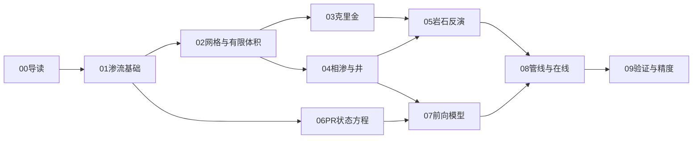

# 00 导读与学习路线

> 给会写 Python、但没有油藏数值模拟背景的人。读完本系列，应能对着源码说出
> 「这段代码在解什么方程、为什么这样离散、和实验室三维场重构有什么关系」，
> 并且**不跑程序也能估出数量级、一眼看出结果离不离谱**。

每章的固定结构：直观理解 → 物理方程 → 离散与算法 → 代码对照 → 小练习 → 章末测试题。
正文里穿插两种提示框：

- **形象化**：用生活里的东西类比，帮你建立画面。
- **工程直觉**：量级估算和「一眼判断」的规则。这是工程师比公式更常用的东西。

## 一、这个软件解决什么问题

实验室做一个 **30 cm 立方体** 的页岩油岩心，中间一口井注纯 CO₂，四周几口井采油。
岩心里只有十几到二十几个测点能报压力和饱和度。软件要把这些稀疏观测变成整块三维网格上的场：

- 压力 \(p\)
- 三相饱和度 \(S_w, S_o, S_g\)（水、油、气，三者之和为 1）
- 孔隙度 \(\phi\) 和渗透率 \(k\)

页岩油 CO₂ 吞吐的关键画面是 **CO₂ 羽流**：一部分 CO₂ 溶进油里跟着油走，超量的以自由气
留在孔隙里，并在密度差作用下往下沉。克里金插值会把羽流抹平；前向模型用质量守恒把羽流算回来，
再把算出来的饱和度喂给岩石反演，得到自洽的 \(k/\phi\)。

> **形象化**：把岩心想成一块泡在高压锅里的海绵，里面插了 27 根温度计（测点）。
> 你只能读这 27 根温度计，却要画出整块海绵里每一处的「温度」（压力、含气量）。
> 插值是「在温度计之间连平滑曲线」；前向模型是「知道往里打了多少气，按物理规律推算气该去哪」。

一句话数据流：

```
case.yaml + 测点/井时序
    → 网格 + 测点/井映射
    → 克里金插值全场 p / sat
    → 反演 k / φ
    → 前向模拟 sat（可选，质量守恒）
    → 再反演 k / φ（定点耦合一遍）
    → 文件或 UDP 场
```

离线跑 `python -m src examples/small/case.yaml -o results/small`；在线走 TCP 入站 + UDP 出站，
见 [联调指南](../联调指南.md)。

## 二、先修知识

不需要油藏工程学位。需要：

| 先修 | 用在哪 |
|---|---|
| 多元微积分：散度、梯度、链式法则 | 达西定律、质量守恒、有限体积 |
| 线性代数：稀疏矩阵、最小二乘 | TPFA 拉普拉斯、克里金方程组、反演 Jacobian |
| 常微分方程初值问题 | 全隐式时间离散、牛顿法 |
| Python + NumPy/SciPy | 读源码、跑小练习 |

热力学（逸度、闪蒸）在第 06 章从理想气体讲起，不要求事先会。

## 三、推荐阅读顺序



1. 本篇 → 知道符号、单位、术语、数量级。
2. [01-油藏渗流基础](01-油藏渗流基础.md) → 达西定律与质量守恒（后面所有方程的源头）。
3. [02-网格与有限体积离散](02-网格与有限体积离散.md) → 代码里的网格、TPFA、按相势迎风。
4. [03-克里金插值](03-克里金插值.md) 与 [04-相对渗透率与井模型](04-相对渗透率与井模型.md) 可并行。
5. [05-岩石参数反演](05-岩石参数反演.md) → 本软件的核心反问题。
6. [06-PR状态方程与闪蒸](06-PR状态方程与闪蒸.md) → CO₂ 溶不溶、气液怎么劈。
7. [07-前向模型：从黑油到组分](07-前向模型：从黑油到组分.md) → 用守恒替代克里金饱和度。
8. [08-管线与在线会话](08-管线与在线会话.md) → 模块怎么串起来。
9. [09-验证与精度](09-验证与精度.md) → 怎么判断对不对。

读完原理系列后再看：

- [技术原理与架构](../技术原理与架构.md) — 一页纸总览与路线图
- [案例库](../案例库.md) — `case.yaml` 字段
- [接口协议](../接口协议.md) / [联调指南](../联调指南.md) — 对接仪表盘
- [相似换算](../相似换算.md) — 实验室 ↔ 矿场
- [压力方程逐项对照](../压力方程逐项对照.md) — 和 OPM/MRST 逐项对比

源码入口：`src/core/` 纯计算，`src/programs/` 求解器与管线，`src/cli/main.py` 命令行。

## 四、符号表

本系列公式与代码共用这些符号。代码里往往把希腊字母写成 ASCII（`phi`、`lam`）。

| 符号 | 代码名 | 含义 | SI 单位 |
|---|---|---|---|
| \(\phi\) | `phi` | 孔隙度（孔隙体积 / 总体积） | 无量纲，(0, 1) |
| \(k\) | `k` | 绝对渗透率 | m²（输入常写 mD） |
| \(p\) | `p` | 压力（前向模型里是以液相为参考的压力） | Pa |
| \(S_w, S_o, S_g\) | `sw, so, sg` | 水/油/气饱和度 | 无量纲，和为 1 |
| \(\mu_\alpha\) | `mu_w/o/g` | 相粘度 | Pa·s |
| \(k_{r\alpha}\) | `krw/kro/krg` | 相对渗透率 | 无量纲 |
| \(\lambda_\alpha = k_{r\alpha}/\mu_\alpha\) | `lam_w/o/g` | 相流度 | 1/(Pa·s) |
| \(\lambda_t\) | `lam_t` | 总流度 \(\sum\lambda_\alpha\) | 1/(Pa·s) |
| \(c_t\) | `ct` | 总压缩系数 | 1/Pa |
| \(\Delta\rho\, g\) | `FluidParams.rho_g` | **气相相对液相的浮力头** \((\rho_{\mathrm{CO_2}}-\rho_{\mathrm{oil}})g\)，>0 表示气比油重、下沉 | Pa/m |
| \(q\) | `qw/qo/qg` | 井源（注入为正） | m³/s（地面或储层，看上下文） |
| \(R_s\) | `Rs` | 溶解气油比 | 地面 m³ 气 / 地面 m³ 油 |
| \(B_g\) | `bg` | 气体积系数 | 储层 m³ / 地面 m³ |
| \(z\) | `z` | 烃内 CO₂ 总摩尔分数 | 无量纲 |
| \(V\) | `V` | 闪蒸气相摩尔分数 | 无量纲 |
| \(x, y\) | `x, y` | 液相 / 气相摩尔组成 | 无量纲 |
| \(N\) | `N` | 烃总摩尔密度 | mol/m³ |
| \(C\) | `C` | CO₂ 地面体积浓度 | 地面 m³ / 储层 m³ |
| \(T_{ij}\) | 传导率 `t` | TPFA 面传导率 | m³/(Pa·s) |
| \(WI\) | `wi` | Peaceman 井指数（不含流度） | m³ |

下标 \(\alpha \in \{w, o, g\}\)（或液相 \(\ell\)）表示相。网格单元用平坦下标
`cell = k*ny*nx + j*nx + i`，可视化 reshape 成 `(nz, ny, nx)`。坐标 \(z\) **向上为正**，
`k=0` 是底层。

注意 `rho_g` 这个名字容易误导：它不是气体密度，而是「气比油重多少」再乘 \(g\)。
页岩油案例取 759 Pa/m，对应 \(\Delta\rho = 759/9.81\approx 77\) kg/m³（CO₂ 约 590、死油约 513 kg/m³）。
`WellModelParams.rho_g` 则是井筒里流体的静水头，两者含义不同。

## 五、单位表与数量级速查

内部计算一律 SI。YAML / CSV 在 IO 边界由 [`src/core/units.py`](../../src/core/units.py) 换算。

| 量 | 工程常用 | SI | 换算 |
|---|---|---|---|
| 长度 | cm, mm, ft | m | `to_metres` |
| 时间 | min, h, d | s | `to_seconds` |
| 压力 | MPa, bar, psi | Pa | `to_pa`；`1 MPa = 1e6 Pa` |
| 渗透率 | mD, D | m² | `1 mD = 9.86923266716013e-16 m²`（`MD_TO_M2`） |
| 粘度 | cP | Pa·s | `1 cP = 1e-3 Pa·s` |
| 流量 | mL/min, m³/d | m³/s | `to_m3_s` |

> **工程直觉：页岩油案例数量级速查**（`examples/shale_oil/case.yaml`，下面数字都用 Python 算过）
>
> | 量 | 数值 | 一句话含义 |
> |---|---|---|
> | \(k\) | 0.03 mD ≈ \(3\times10^{-17}\) m² | 超低渗，比砂岩低 4–5 个数量级 |
> | 孔隙体积 | \(0.05\times0.027\) m³ = 1350 mL | 整块岩心只能装一大瓶矿泉水 |
> | 油 / 气粘度 | 2 cP / 0.02 cP | 气比油稀 100 倍 |
> | \(c_t\) | \(1.2\times10^{-9}\) 1/Pa | 每升压 1 MPa，孔隙里多「挤进」约 1.6 mL |
> | 压力扩散时间（半边长 0.15 m） | \(\phi\mu c_t L^2/k\approx 90\) s | 压力分钟级就传遍，岩心是准稳态 |
> | 气比油重的浮力头 | 759 Pa/m，全高 0.3 m 只有 228 Pa | 远小于注入压差（MPa 级） |
> | 注入储层体积速率 | \(8.33\times10^{-8}\times0.003\approx 2.5\times10^{-10}\) m³/s | 灌满一个孔隙体积约 60 天 |
>
> 用法：看到结果先对量级。比如某处压力 1 秒内变了 1 MPa，或 1 天内气就走完 30 cm，基本可以先怀疑单位或符号错了。

实验室默认是 0.30 m 立方；矿场尺度由 `similarity.field_*_m` 给出，UDP `--field-port` 发换算后的坐标与时间。

## 六、术语中英对照

| 中文 | 英文 | 本仓库里出现的位置 |
|---|---|---|
| 孔隙度 | porosity | `phi`, `rock.phi0` |
| 渗透率 | permeability | `k`, `k0_md` |
| 饱和度 | saturation | `sw/so/sg` |
| 束缚水 / 残余油 / 临界气 | connate water / residual oil / critical gas | `swc`, `sor`, `sgc` |
| 相对渗透率 | relative permeability | Corey / 表格 `RelpermTable` |
| 流度 | mobility | \(\lambda = k_r/\mu\) |
| 达西定律 | Darcy's law | 通量 \(\mathbf{v} = -k\lambda(\nabla p+\rho g\nabla z)\) |
| 两点通量近似 | TPFA | `tpfa_matrix` |
| 迎风 / 相势迎风 | upwind / phase-potential upwinding | `_mobility_divergence_matrix`、`_phase_divergence_matrix` |
| 普通克里金 | ordinary kriging | `ordinary_kriging` |
| 变差函数 | variogram | `VariogramModel` |
| 井指数 | well index | `peaceman_wi` |
| 井筒半径 / 表皮 | wellbore radius / skin | `rw`, `skin` |
| 黑油模型 | black-oil | `forward.model: black_oil` |
| 溶液气 / 组分模型 | solution-gas / compositional | `compositional`, `compositional_two` |
| 闪蒸 | flash | `pr_eos._flash` |
| 泡点 | bubble point | `rs_sat`, 气相刚出现的组成 |
| 全隐式 | fully implicit (FIM) | `_implicit_*_step` |
| IMPES | implicit pressure explicit saturation | `black_oil_forward` |
| 反演 | inversion | `invert_rock` |
| 羽流 | plume | 自由气在底部的富集 |
| 捕集 / 滞回 | trapping / hysteresis | `sg_max` |
| 几何因子 | geometry factor | GEM `GEOMETRY`，`geofac` |

## 七、小练习

在仓库根目录、已 `pip install -e ".[dev]"` 的环境里：

```python
from src.core.units import MD_TO_M2, to_m2, to_pa, to_pa_s, to_m3_s

assert abs(to_m2(1.0, "mD") - MD_TO_M2) < 1e-30
print("1 mD =", to_m2(1.0, "mD"), "m^2")
print("20 MPa =", to_pa(20.0, "MPa"), "Pa")
print("2 cP =", to_pa_s(2.0, "cP"), "Pa.s")
print("1 mL/min =", to_m3_s(1.0, "mL/min"), "m3/s")
```

应打印 `1 mD ≈ 9.87e-16 m²`，`20 MPa = 2e7 Pa`。

## 八、章末测试题

**1.** 网格 `nx = ny = 15`，单元 `(i, j, k) = (2, 3, 1)` 的平坦下标是多少？它在 `reshape_ijk` 后的数组里怎么取？

<details><summary>答案与解析</summary>

\(1\times15\times15 + 3\times15 + 2 = 272\)。reshape 后是 `field[k, j, i] = field[1, 3, 2]`。
轴顺序是 `(nz, ny, nx)`，最慢变化的是 `k`。常见错误是写成 `reshape(nx, ny, nz)`，那样图上层和列会对调。

</details>

**2.** 页岩油案例 `k0_md: 0.03`，换成 m² 大约是多少？和常见砂岩（100 mD）差几个数量级？

<details><summary>答案与解析</summary>

\(0.03\times 9.87\times10^{-16}\approx 2.96\times10^{-17}\) m²。和 100 mD 比差 \(100/0.03\approx 3300\) 倍，约 3.5 个数量级。
渗透率是流量的直接比例系数，所以同样压差下流量也小这么多。

</details>

**3.** `FluidParams.rho_g = 759` 的单位是什么？它对应的密度差是多少？是正还是负意味着 CO₂ 下沉？

<details><summary>答案与解析</summary>

单位是 Pa/m，是 \((\rho_{\mathrm{CO_2}}-\rho_{\mathrm{oil}})g\)。密度差 \(759/9.81\approx 77\) kg/m³（约 590 − 513）。
**正值表示气比油重、下沉**。历史上这里填过 −1421，那是没做 Peneloux 平移、把 CO₂ 密度算成 370 kg/m³ 的结果（见第 06 章）。

</details>

**4.** 这块岩心的孔隙体积是多少毫升？如果注入的 CO₂ 在储层条件下以 \(2.5\times10^{-10}\) m³/s 进入，灌满一个孔隙体积要多久？

<details><summary>答案与解析</summary>

\(0.3^3\times0.05 = 1.35\times10^{-3}\) m³ = 1350 mL。时间 \(1.35\times10^{-3}/2.5\times10^{-10}\approx 5.4\times10^6\) s ≈ 62 天。
所以 30 天实验大约只注了半个孔隙体积（储层体积计）。文档里常说的「160 PV」是按**地面**体积算的，差一个 \(1/B_g\approx 333\) 倍——
读到「PV」时一定要问是地面还是储层体积。

</details>

**5.** `forward.model: none` 时，输出的饱和度场来自哪里？质量守恒吗？

<details><summary>答案与解析</summary>

来自克里金插值（再投影到 \(S_w+S_o+S_g=1\)）。不守恒：插值不知道井注了多少 CO₂。这是联调默认值，因为快且稳定。

</details>

**6.** 判断：「内部统一 SI，所以 YAML 里写 `ct_1pa: 1.2e-9` 和写 `k0_md: 0.03` 的处理方式一样，都直接用。」

<details><summary>答案与解析</summary>

错。`ct_1pa` 已经是 SI（1/Pa），直接用；`k0_md` 是 mD，要乘 `MD_TO_M2`。字段名后缀就是单位提示（`_md`、`_pa_s`、`_1pa`）。
单位错通常表现为结果差出整数个数量级（例如 \(10^{15}\)），这是排查的第一线索。

</details>

## 九、延伸阅读

- Lie, *An Introduction to Reservoir Simulation Using MATLAB/MRST*（网格、TPFA、黑油；仓库 `reference_projects/MRST-main`）
- Aziz & Settari, *Petroleum Reservoir Simulation*（守恒方程与隐式格式）
- Chen, Huan, Ma, *Computational Methods for Multiphase Flows in Porous Media*（有限体积）
- 下一篇：[01-油藏渗流基础](01-油藏渗流基础.md)
