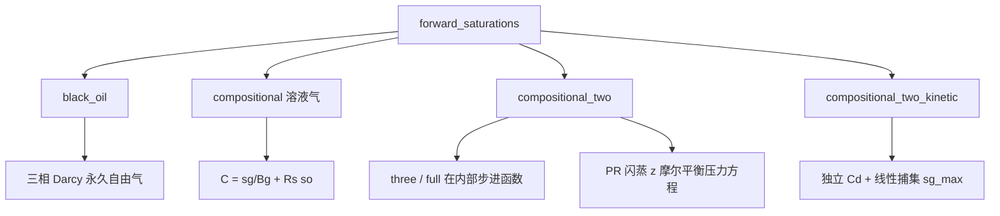

# 07 前向模型：从黑油到组分

> 用质量守恒的饱和度场替换克里金。主文件 [`src/programs/forward.py`](../../src/programs/forward.py)
> （约 3400 行）。和 OPM/MRST 的逐项对比见 [压力方程逐项对照](../压力方程逐项对照.md)。

## 一、直观：IMPES vs 全隐式

饱和度方程是双曲型的：信息沿流线走，锋面可以很陡。两种经典时间离散：

| | IMPES | 全隐式 FIM |
|---|---|---|
| 压力 | 隐式 | 隐式 |
| 饱和度 / 组成 | 显式（用旧流度） | 与压力联立隐式 |
| 时间步 | 受 CFL / \(\Delta S\) 限制 | 可大步，牛顿更贵 |
| 本仓库 | `black_oil_forward`（显式子步，`max_ds=0.05`） | `_implicit_*_step` 是主力 |

全隐式一步：未知 \(x^{n+1}\)，残差 \(R(x^{n+1})=0\)，牛顿 \(J\delta = -R\)。
不收敛就 **自适应子步**：把 \(\Delta t\) 减半重试，成功后再把步长放大（`_implicit_compositional_two_adaptive` 放大 2 倍，
`_forward_compositional_*` 的主循环放大 1.5 倍；对应 CMG `*DTMIN/*DTMAX`）。

> **形象化**：IMPES 是「先开会定好水位（压力），再各自搬水（饱和度）」，搬得太快会把一个水箱搬空成负数，所以每次只能搬一点。
> 全隐式是「所有人同时商量水位和搬运量，直到大家都满意」，可以一次搬很多，但每次商量（牛顿迭代）都很贵。
>
> **工程直觉**：显式步长上限大约是「一个格子的孔隙体积 / 流进它的流量 × 允许的 \(\Delta S\)」。
> 近井格子流量大、孔隙体积小，所以显式格式在井边步长最小——这就是注入井附近总是最难算的原因。

## 二、牛顿、Jacobian、线性求解

典型双组分主变量 \((p, S_w, z)\)，残差三块（再加定流量井的一个标量约束）。
闪蒸对 \(p,z\) 强非线性，Jacobian 里对状态的导数用步长 \(h=10^{-6}\) 的数值差分；
通量对势的导数用解析的迎风 TPFA（`_upwind_tpfa_matrix_vec`），气相按气相势、液相按 \(p\)。

定流量注入井：总气率已知，注入 BHP 未知。牛顿系统多一行 `r_rate`，用 **Schur 补**把这一个未知消掉，
只需多解一次同规模的线性系统，而不是改变矩阵结构。

`_solve_linear`：先 GMRES（50 次）；不行再 pyamg 光滑聚合预条件 + GMRES；再不行 `spsolve` 直接 LU。
饱和对流块非对称，纯 GMRES 容易停转。

> **工程直觉：Jacobian 只影响收敛速度，不影响答案**。解由残差 \(R=0\) 决定，Jacobian 近似得不好只会多迭代几次、
> 或者让线搜索频繁缩步。所以排查「结果不对」时先看残差写没写对；排查「不收敛/很慢」时才看 Jacobian。

## 三、模型层级

`forward_saturations(model=...)` 分发：



| `model` | 物理增量 | 压力方程（当前代码） |
|---|---|---|
| `black_oil` | 三相体积守恒，气不溶 | 每子步单独解一次总流度压力 |
| `compositional` | 亨利/EOS \(R_s\)，守恒 \(C\) | 溶液气压力步：TPFA + Peaceman + `accum·ct·(p-p0)` |
| `compositional_two` | 双组分 PR 闪蒸 \((p,sw,z)\) | **总烃摩尔平衡**（见下一节） |
| `compositional_three` / `full` | 3 / 14 组分 | 同摩尔平衡思路，步进函数独立 |
| `compositional_two_kinetic` | \(k_{\mathrm{diss}}\) + 捕集 | 体积平衡 + 岩石压缩性 + 气相按相势迎风 |

CLI `--model` 目前只有 `none | black_oil | compositional`。`two/three/full/kinetic` 要从 YAML `forward.model` 或 Python API 调。
管线在 `forward.model in {none, off, skip, kriging}` 时**跳过前向**。

## 四、总摩尔平衡压力方程

旧写法（总流度体积平衡）\(r_p = A\lambda_t - q_{\mathrm{vol}} = 0\) 是稳态「进出体积相等」。
问题：\(v_g\) 和 \(v_\ell\) 差很多时，体积平衡**不是**摩尔平衡的替身——油组分会从方程里漏掉（审计编号 B1）。

双组分当前残差（`_implicit_compositional_two_step.residual`）：

\[
N = \frac{1-S_w}{V v_g+(1-V)v_\ell},
\quad
q_N = \frac{q_g}{V_{\mathrm{CO_2}}^{\mathrm{std}}} + \frac{q_o}{v_\ell},
\]

\[
r_p = \mathrm{accum}\,(N-N^0) - q_N
+ A_g\Bigl(\frac{\lambda_g}{v_g}\Bigr) + A\Bigl(\frac{\lambda_\ell}{v_\ell}\Bigr),
\]

`accum` \(=\phi V/\Delta t\)，\(A=A(p)\)、\(A_g=A(p+\Delta\rho g z)\)（第 02 章的按相势迎风）。

- **流体压缩性**已经在 \(\mathrm{accum}(N-N^0)\) 里：\(N\) 通过 EOS 摩尔体积依赖 \(p\)。
- **岩石压缩性没有进去**：`accum` 用的是常数 \(\phi\)，没有 \(\phi(p)=\phi_0(1+c_r(p-p_0))\)。
  溶液气压力步和动力学步里的 `accum*ct*(p-p0)` 是把总压缩性一起加上的，双组分/三组分/全组分步没有这一项。
  这是一个已知缺口（\(c_r\) 对页岩通常是 \(10^{-10}\)–\(10^{-9}\) 1/Pa 量级，和流体压缩性可比）。

油摩尔 \(\propto (1-z)N\)。总摩尔守恒 + CO₂ 守恒 ⇒ 油守恒，不需要再写一条油方程。
极限 \(v_g=v_\ell\) 时回到体积平衡。MRST 用偏摩尔体积加权 \(\sum_c(\partial V/\partial N_c)R_c\)，本仓库直接守恒总摩尔。

CO₂ 残差：

\[
r_C = \mathrm{accum}(C-C^0) - q_C + A_g\, m_{\mathrm{gas}} + A\, m_{\mathrm{liq}},
\]

自由气部分 \(m_{\mathrm{gas}}=y\,(V_{\mathrm{STD}}/v_g)\lambda_g\) 走气相势，溶解部分 \(m_{\mathrm{liq}}=x\,(V_{\mathrm{STD}}/v_\ell)\lambda_\ell\) 走 \(p\)，
和压力方程里液相的处理一致。水相是 `accum(sw-sw0) - qw + A λ_w`。

> **形象化**：体积平衡像「按占地面积点名」，摩尔平衡像「按人头点名」。CO₂ 溶进油以后，人头没少，占地面积却缩了。
> 按面积点名会以为有人走了，于是从别处「补人」进来——补进来的就是凭空多出来的油。
>
> **工程直觉**：检查油守恒最简单的办法：无生产井时算 \(\sum\phi V(1-z)N\)，每一步都应该不变。
> `test_molar_pressure_conserves_oil` 就是这样做的（三步注入后相对漂移 <1%）。

## 五、相劈分（双组分）

`_split_compositional_two`：

```
flash_direct_volumes(p, z) → V, x, y, v_l, v_g    # 死油基底
N = (1-sw) / (V*v_g + (1-V)*v_l)
sg = V * N * v_g
sl = (1-V) * N * v_l
C = z * N * V_CO2_STD
```

注入纯 CO₂：井源 \(q_C=q_g\)（地面）。生产井：\(q_C = y q_g + x (V_{\mathrm{STD}}/v_\ell) q_o\)。

动力学劈分 `_split_compositional_two_kinetic`：自由气由尚未溶解的 CO₂ 决定，\(S_g = (C-C_d)\,v_g/V_{\mathrm{STD}}\)，
溶解量 \(C_d\) 以 \(k_{\mathrm{diss}}\) 趋向闪蒸平衡。见 [非润湿气相驱替设计](../非润湿气相驱替设计.md)。

## 六、重力：需要多久才能分层

气相多出的浮力通量是 \(k\lambda_g\Delta\rho g\)。页岩油案例 \(k=3\times10^{-17}\)、\(\mu_g=2\times10^{-5}\)、\(\Delta\rho g=759\)：

| \(k_{rg}\) | 重力驱动达西速度 | 30 天纯重力推进距离（\(\phi S_g = 0.05\times0.3\)） |
|---|---|---|
| 0.046 | \(5.2\times10^{-11}\) m/s | 约 0.9 cm |
| 0.25 | \(2.8\times10^{-10}\) m/s | 约 5 cm |
| 1.0 | \(1.1\times10^{-9}\) m/s | 约 19 cm |

> **工程直觉**：在 0.03 mD 的岩心里，**纯重力 30 天只能让气下沉几厘米**，除非气已经连成高饱和度的通道。
> 所以如果 GEM 在 30 天里把自由气集中到底部三层（0–6 cm），不能只用「CO₂ 比油重」来解释，
> 井位、压力驱动的流动路径、溶解与析出的位置同样重要。反过来，如果前向模型里重力项写反或迎风取错，
> 短时间内看不出来，长时间才慢慢累积——这类问题要靠两格算例这样的单元测试抓，不能指望看 30 天结果。

## 七、复查发现的问题与修复

| # | 问题 | 物理后果 | 处理 |
|---|---|---|---|
| 1 | 重力算子 `A - rho_g*A_grav` 按 \(-z\) 迎风，`rho_g>0` 时取了**下游**格子的流度 | 上格有气、下格无气时重力通量为 0，气沉不下去；下格有气时上格「流出」不存在的气 | 已修：`_phase_divergence_matrix` 按气相势 \(p+\Delta\rho gz\) 一次判断上游；所有步进函数与 Jacobian 势导数块同步 |
| 2 | 双组分 `r_c` 里溶解 CO₂ 走了 \(A_g\)，但 `r_p` 的液相走 \(A\)，`J_cp` 也用 \(A\) | CO₂ 在液相里「单独下沉」而油不动，相当于在液相内部凭空分离组分；残差和 Jacobian 不一致拖慢牛顿 | 已修：液相统一走 \(A\)（液相是参考势） |
| 3 | 判相表用原生油、闪蒸用死油 | 实测没有导致错误结果（原生油液相区更窄，只多做了精确闪蒸） | 已统一为死油表 |
| 4 | 接近纯 CO₂（\(z\gtrsim0.995\)）时闪蒸落到平凡解，\(V\) 任意 | 注入井附近 \(S_g/S_\ell\) 劈分没有物理意义 | **未修**，见第 06 章第四节，建议加相稳定性分析 |
| 5 | 双组分/多组分摩尔残差没有岩石压缩性 | 升压阶段注入量被高估地用于驱油 | **未修**，已知缺口 |

修复 1、2 的回归测试见 `tests/test_gravity_upwind.py`；修复后 `pytest -m "not slow"` 全部通过。

## 八、和克里金怎么接

`run_pipeline`：

1. 克里金得到 \(p(t), S(t)\)，反演 \(k,\phi\)。
2. 若开启前向：从 \(t=0\) 的束缚水/残余油/临界气初值，用井率 +（可选）BHP 往前积分，**丢掉克里金饱和度**。
3. 用前向饱和度**再反演一次** \(k,\phi\)（定点耦合一轮）。

压力目前仍来自克里金（组分模型内部会解 \(p\)，但管线输出的 `fields.p` 仍是插值场）。

## 九、代码对照

| 概念 | 函数 |
|---|---|
| 入口 | `forward_saturations` |
| TPFA / 迎风 / 相势 | `tpfa_matrix`、`_mobility_divergence_matrix`、`_phase_divergence_matrix`、`_upwind_tpfa_matrix_vec` |
| 线性解 | `_solve_linear` |
| 黑油 | `black_oil_forward`（IMPES）、`_implicit_black_oil_step` |
| 溶液气 | `_implicit_compositional_step`、`_implicit_compositional_pressure_step` |
| 双组分摩尔平衡 | `_implicit_compositional_two_step` |
| 自适应子步 | `_implicit_compositional_two_adaptive` |
| 动力学 + 捕集 | `_implicit_compositional_two_kinetic_step` |
| 3 / 14 组分 | `_implicit_compositional_three_step`、`_implicit_compositional_full_step` |
| 回归 | `tests/test_compositional_fim.py`、`tests/test_forward.py`、`tests/test_gravity_upwind.py` |

## 十、小练习

```python
import numpy as np
from src.programs.forward import _split_compositional_two
from src.programs.rock import FluidParams

params = FluidParams()
sw = np.full(3, params.swc)
p = np.full(3, 20e6)
for zval in (0.0, 0.30, 0.60):
    z = np.full(3, zval)
    _, sl, sg, V, x, y, N, C, O, v_l, v_g = _split_compositional_two(sw, z, p, params)
    print(f"z={zval:.2f}  V={float(V[0]):.3f}  sg={float(sg[0]):.3f}  N={float(N[0]):.0f} mol/m3")
```

\(z=0\) 和 0.30（泡点以下）时 \(S_g=0\)；\(z=0.60\) 时出现自由气。

## 十一、章末测试题

**1.** 15³ 网格的双组分全隐式，一次牛顿迭代的未知数有多少个（定流量注入）？

<details><summary>答案与解析</summary>

\(3\times3375+1=10126\)：每格 \(p, S_w, z\)，外加一个注入井 BHP。Schur 补把 BHP 消掉，实际解的是 10125 维稀疏系统（两次）。

</details>

**2.** 为什么定流量注入井要用 Schur 补，而不是直接把 BHP 行拼进矩阵？

<details><summary>答案与解析</summary>

BHP 那一行/列是稠密的（与所有完井格子耦合），拼进去会破坏稀疏结构和预条件。
Schur 补只需对原稀疏矩阵多解一个右端项（`u = J⁻¹ B_c`），再用一个标量方程求 \(\delta_{\mathrm{bhp}}\)。

</details>

**3.** 纯重力条件下，\(k_{rg}=0.25\)、\(S_g=0.3\)，气 30 天大约下沉多远？这说明什么？

<details><summary>答案与解析</summary>

达西速度 \(kk_{rg}\Delta\rho g/\mu_g = 2.96\times10^{-17}\times0.25\times759/2\times10^{-5}\approx2.8\times10^{-10}\) m/s，
孔隙流速 \(/(\phi S_g)=1.9\times10^{-8}\) m/s，30 天约 4.9 cm。
超低渗岩心里重力分异很慢，30 天的羽流形态主要由注入和压力驱动决定，重力是次要但长期累积的效应。

</details>

**4.** 读代码：`A_g = A - rho_g * _mobility_divergence_matrix(grid, k, -z)`，`rho_g=759`。第 02 章两格算例（只有上格有气）会得到什么？对 30 天模拟的影响是什么？

<details><summary>答案与解析</summary>

重力通量为 0：它取了下格（下游）的流度。整体效果是气只能在「下面已经有气」的地方往下走，
羽流很难从注入层沉到底部；由于纯重力本来就慢（上一题），这种错在短时间里几乎看不出来，只会让长时间的分层偏弱。

</details>

**5.** 修复前，双组分 `r_c` 里溶解 CO₂ 用 \(A_g\)、`r_p` 里液相用 \(A\)。这相当于什么非物理过程？

<details><summary>答案与解析</summary>

液相里的 CO₂ 分子额外受到向下的「浮力」，而同一液相里的油分子没有。液相内部 CO₂ 与油被重力分离，
像在液体里做了一次离心。真实情况是溶有 CO₂ 的油作为一个整体流动（组成随液相一起走），要么都有重力项要么都没有。

</details>

**6.** 某格 \(S_w=0.05\)，闪蒸得 \(V=0.2\)，\(v_g=7.5\times10^{-5}\)、\(v_\ell=1.6\times10^{-4}\) m³/mol。求 \(N\) 和 \(S_g\)。

<details><summary>答案与解析</summary>

分母 \(0.2\times7.5\times10^{-5}+0.8\times1.6\times10^{-4}=1.43\times10^{-4}\)，\(N=0.95/1.43\times10^{-4}\approx6643\) mol/m³。
\(S_g = VNv_g = 0.2\times6643\times7.5\times10^{-5}\approx0.10\)，\(S_\ell\approx0.85\)。
直觉：20% 的摩尔在气相，只占约 10% 的孔隙体积，因为这里气相摩尔体积比液相小（超临界 CO₂ 很致密）。

</details>

**7.** `_implicit_compositional_two_adaptive` 目标步长 864 s、`dt_min = dt/64`。最多减半几次就放弃？最小子步多长？

<details><summary>答案与解析</summary>

\(864/64=13.5\) s，从 864 减半到 13.5 需要 6 次（\(2^6=64\)）。再减就低于 `dt_min`，放弃并返回 `converged=False`。
经验：泡点附近、注入刚开始时最容易触发减半。

</details>

**8.** 判断：「牛顿收敛了，说明结果物理上正确。」

<details><summary>答案与解析</summary>

错。收敛只说明残差方程被解了。残差本身写错（例如重力迎风方向、液相重力不一致、平凡解闪蒸）时，
牛顿照样能收敛到一个错的解。物理正确性要靠守恒检查、单元算例和真值对照（第 09 章）。

</details>

## 十二、延伸阅读

- Aziz & Settari，第 5 章（IMPES / 全隐式）
- Lie, MRST 教材第 8、10 章（相势迎风、全隐式）
- OPM Flow / MRST `equationsCompositional.m`（摩尔守恒压力方程）
- [组分前向模型实施与测试](../组分前向模型实施与测试.md)
- 下一篇：[08-管线与在线会话](08-管线与在线会话.md)
