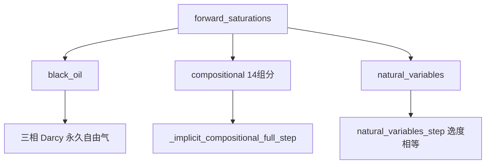

# 07 前向模型：从黑油到组分

> 一句话本质：用**守恒**替代**克里金**来算饱和度。插值不知道井注了多少 CO₂，会把羽流抹平；
> 前向模型把 01 章的守恒方程 + 02 章的离散 + 04 章的相渗井 + 06 章的闪蒸拼起来，在时间上一步步推进。
> 主文件 [`src/programs/forward.py`](../../src/programs/forward.py)（约 1700 行）与
> [`src/programs/natural_variables.py`](../../src/programs/natural_variables.py)（约 720 行，自然变量 FIM）。
> **本章讲旧版 `(p,sw,z)` + 闪蒸路径；代码前沿的自然变量 FIM（逸度相等替代闪蒸）见 [07b](07b-自然变量FIM：用逸度相等消除泡点奇异.md)。**
> 和 OPM/MRST 的逐项对比见 [压力方程逐项对照](../压力方程逐项对照.md)。

**本章概念脉络**（每个概念都在解决一个问题，按出现顺序）：

| 概念 | 它解决的问题 |
|---|---|
| 显式 → 半隐式 IMPES → 全隐式 FIM | 时间怎么离散：步长被 CFL 限制，逐级升级取消它 |
| 牛顿法 + Jacobian | 隐式方程非线性，怎么解 |
| Schur 补 | 定流量井的 BHP 未知，怎么不破坏稀疏性 |
| 总摩尔平衡 | 体积平衡在 \(v_g\ne v_\ell\) 时会漏掉油 |
| 相劈分 | 从 \((p,z)\) 怎么得到 \(V,N,S_g,C\) |
| 自适应子步 | 牛顿不收敛时怎么办 |

## 零、问题：守恒方程怎么变成能跑的代码？

01 章给了守恒方程，02 章给了离散，04 章给了参数，06 章给了闪蒸。现在要把它们**拼成一个时间步进的求解器**。
这条路上遇到的新问题，就是本章逐个解决的内容。

## 一、第一个问题：时间怎么离散？显式 → 半隐式 → 全隐式

饱和度方程是双曲型的：信息沿流线走，锋面可以很陡。把守恒方程在时间上推进，核心选择只有一件事：
**方程里的系数（流度 \(\lambda\) 等）和未知量（压力、饱和度），在哪个时间层取值？** 三种取法，就是三种方案，一步比一步「隐式」。

**① 显式（explicit）：全用旧时刻的已知值**

流度、压力、饱和度全用上一时刻 \(n\) 的值，直接代数算出 \(S^{n+1}\)，**不需要解方程组**，每个格子独立更新。
**死穴**：步长受 **CFL 稳定性条件**限制——超过临界值就振荡、饱和度为负、发散。压力扩散项尤其刚，允许步长小到实际没法用。

**② 半隐式 IMPES（Implicit Pressure, Explicit Saturation）**

关键观察：**压力和饱和度的时间尺度差几个数量级**——压力（扩散型）分钟级就平衡，饱和度（对流锋面）慢慢走，所以「刚」的主要是压力。
**方法**：压力方程**隐式**解（放 \(n+1\)，解一次线性方程组），但流度仍用旧值 \(n\)；再用新压力算流速，**显式**更新饱和度。
**它解决的问题**：把最刚的压力扩散项隐式化，步长能放大一个数量级以上，而饱和度显式更新很便宜。
**仍受限制**：饱和度还是显式，CFL 限制还在——近井流量大、锋面陡处，\(\Delta S\) 一步不能超过 `max_ds=0.05`，步长仍小。

**③ 全隐式 FIM（Fully Implicit）**

**方法**：压力、饱和度、组成、流度**全部放到 \(n+1\)**，联立成一个非线性方程组 \(R(x^{n+1})=0\)，牛顿迭代一次解出。
**它解决的问题**：IMPES 的饱和度 CFL 限制，在组分模型（气驱、近井尖锋面）里是致命的。全隐式**取消 CFL 限制**（无条件稳定），步长可从秒级放到天级。
**代价**：每步贵——牛顿迭代几次，每次解一个「压力 + 饱和度 + 组成」耦合的大稀疏线性方程组（还要反复闪蒸），不收敛再减半重试。

| | 显式 | 半隐式 IMPES | 全隐式 FIM |
|---|---|---|---|
| 系数/未知取哪层 | 全旧时刻 n | 压力 n+1、流度 n、饱和度显式 | 全 n+1 联立 |
| 要解方程组吗 | 不要 | 一次线性（压力） | 牛顿迭代 + 大稀疏线性 |
| 时间步 | CFL 限制，最小时步 | 压力可大步、饱和度仍 CFL | 无条件稳定，可大步 |
| 每步成本 | 最低 | 低 | 高 |
| 本仓库 | — | `black_oil_forward`（显式子步，`max_ds=0.05`） | `_implicit_*_step` 与 `natural_variables_step` 是主力 |

**升级脉络**：显式「步长被压力扩散压死」→ IMPES「压力隐式化，省掉最刚的限制」→ 全隐式「饱和度也隐式化，取消 CFL，用每步更贵换大步长」。

> **还有第四种：自适应隐式 AIM（adaptive implicit）。** 全隐式每步解全体未知、最贵；IMPES 便宜但受 CFL 限。
> AIM 是**混合**：只在「锋面陡、流量大」的格子（近井、前缘）用全隐式，其余格子用 IMPES——刚性处花隐式的钱、
> 光滑处省隐式的钱。这是商业模拟器（GEM/ECLIPSE）的标准提速手段。
> **适用条件（从原理）**：问题里刚性和光滑区域分明时收益最大；若全区域都刚性（本案例近井自由气激波、组分
> 跨泡点），AIM 退化成全隐式、省不了钱。本软件目前只有显式/IMPES/全隐式三档，未做 AIM。

> **时间格式：后向欧拉 vs BDF2 vs Crank-Nicolson。** 本软件隐式用**后向欧拉**（一阶、L-稳定、单调不振荡）。
> 更高阶的 **BDF2**（二阶、仍 L-稳定）能减时间离散误差，代价是两步法（要保留上一时刻）；**Crank-Nicolson**
> （二阶、非 L-稳定）对刚性问题会振荡，油藏里少用。**适用条件**：对 30 天、步长天级的羽流模拟，空间误差和相平衡
> 误差通常盖过时间一阶误差，故后向欧拉已够；要更准的时间分辨率才上 BDF2。

全隐式一步：未知 \(x^{n+1}\)，残差 \(R(x^{n+1})=0\)，牛顿 \(J\delta = -R\)。
不收敛就 **自适应子步**：把 \(\Delta t\) 减半重试，成功后再把步长放大（`_implicit_compositional_full_adaptive` 放大 2 倍，
`_forward_compositional_*` 的主循环放大 1.5 倍；对应 CMG `*DTMIN/*DTMAX`）。

> **形象化**：显式是「看着昨天每个水箱的水位，各自决定今天搬多少」，一次不能搬太多否则水箱被搬空成负数。
> IMPES 是「先开会定好水位（压力，隐式），再各自搬水（饱和度，显式）」，搬水量仍受限。
> 全隐式是「所有人同时商量水位和搬运量，直到大家都满意」，可以一次搬很多，但每次商量（牛顿迭代）都很贵。
>
> **工程直觉**：显式步长上限大约是「一个格子的孔隙体积 / 流进它的流量 × 允许的 \(\Delta S\)」。
> 近井格子流量大、孔隙体积小，所以显式格式在井边步长最小——这就是注入井附近总是最难算的原因。
> 组分模型要大步长（30 天），主力走全隐式；黑油简单，`black_oil_forward` 用 IMPES 就够。

## 二、第二个问题：非线性方程组怎么解？→ 牛顿法

全隐式把「压力、饱和度、组成」全部放 \(n+1\)，得到的是个**非线性方程组** \(R(x)=0\)：
\(x\) 是全体未知量（每格 \(p,S_w,z\)），\(R\) 是全体残差（每格每条守恒方程）。
它非线性，因为流度 \(\lambda(S)\) 依赖饱和度、闪蒸依赖 \((p,z)\)——不能像线性方程那样一步解出来。

### 2.1 先解一元：牛顿法 = 用切线逼近

解 \(f(x)=0\)。手头只有一个猜测 \(x_k\)，就在 \(x_k\) 处画切线，切线和 \(x\) 轴的交点当作下一个猜测：

\[
x_{k+1} = x_k - \frac{f(x_k)}{f'(x_k)}.
\]

例：求 \(\sqrt2\)，即解 \(f(x)=x^2-2=0\)，\(f'(x)=2x\)。从 \(x_0=1\) 出发：
\(x_1=1-\frac{-1}{2}=1.5\)，\(x_2=1.5-\frac{0.25}{3}=1.4167\)，\(x_3=1.4142\)。
看误差：每步正确位数几乎翻倍——这叫**二次收敛**，是牛顿法接近解时快得吓人的原因。

> **形象化**：不会直接解方程，就「猜一个、用切线修正一个」，重复几次就贴到真根上。前提是初始猜测别离根太远，太远切线会指错方向。
>
> **深一层：为什么是「二次」收敛？** 切线是 \(f\) 的一阶近似，误差只能来自二阶项。把 \(f(x^*)=0\) 在 \(x_k\) 处泰勒展开到二阶：
> \(0 = f(x_k) + f'(x_k)(x^*-x_k) + \tfrac12 f''(\xi)(x^*-x_k)^2\)。代入牛顿步，误差 \(e_{k+1}=x^*-x_{k+1}\) 满足
> \(e_{k+1} = -\tfrac12 \frac{f''}{f'}\, e_k^2 = O(e_k^2)\)。误差每步平方、正确位数翻倍，根源就在「切线把一阶信息用到极致，只剩二阶误差」。

### 2.2 推广到多元：Jacobian 就是「多变量的导数」

油藏有成千上万个未知量，\(x\) 和 \(R\) 都是向量。牛顿法同样成立，只是「导数」变成矩阵：

\[
x_{k+1} = x_k - J^{-1} R(x_k),\qquad J_{ij} = \frac{\partial R_i}{\partial x_j}.
\]

\(J\) 叫 **Jacobian 矩阵**：第 \(i\) 行第 \(j\) 列是「第 \(i\) 条残差方程对第 \(j\) 个未知量的偏导数」，即「动一下 \(x_j\)，\(R_i\) 变多少」。
实际不显式求 \(J^{-1}\)（又慢又不稳定），而是每步解一个线性方程组：

\[
J\,\delta = -R,\qquad x \leftarrow x + \delta .
\]

### 2.3 Jacobian 长什么样（结构决定了能不能解得快）

- **行 = 残差方程**（每格每条守恒），**列 = 主变量**（每格 \(p,S_w,z\)）。
- **稀疏**：一格方程只涉及自己和相邻 6 格的变量（通量只连邻居），所以 \(J\) 是和 02 章 TPFA 同构的**块稀疏矩阵**，每块 \(3\times3\)（对应 \(p,S_w,z\)）。几万阶矩阵能解，全靠这个稀疏性。

`_solve_linear`：先 GMRES（50 次）；不行再 pyamg 光滑聚合预条件 + GMRES；再不行 `spsolve` 直接 LU。饱和对流块非对称，纯 GMRES 容易停转。

> **适用条件（从原理）：直接法 LU vs 迭代法 GMRES。** 直接法（LU/高斯消元）精确、稳健、不挑矩阵，但**填充**
> 让存储和计算随规模超线性增长，大稀疏系统用不起。迭代法（GMRES）每步只做几次矩阵乘、内存 O(nnz)、便宜，
> 但对**非对称/病态**矩阵（饱和对流块正是这种）会收敛慢或停转，要靠**预条件**（把方程组变形成更好解的样子，
> 如 AMG 多重网格）提速。**优势/缺点**：LU 稳但贵，GMRES 便宜但挑矩阵。工程打法就是本软件这样三档递进：
> 先 GMRES（便宜）→ 不行加 AMG 预条件（对付病态）→ 再不行 LU 兜底（保正确）。

### 2.4 Jacobian 怎么算（两种导数混着用）

- **通量对势的导数**：解析（迎风 TPFA 的导数矩阵 `_upwind_tpfa_matrix_vec`）——快、准。
- **闪蒸对 \((p,z)\) 的导数**：太复杂，用**数值差分**（把 \(p,z\) 扰动 \(h=10^{-6}\) 看残差变多少）。
- 为什么混着来：闪蒸解析导数繁琐易错，数值差分稳健；通量导数解析更快更准。**哪里推导收益大就解析，哪里复杂就差分。**

### 2.5 迭代循环与不收敛怎么办

```
给初值 x（上一步的解）
循环：
  算残差 R
  若 ||R|| 足够小 → 收敛，收工
  算 Jacobian J
  解 J δ = -R
  x ← x + δ
```

接近解时二次收敛，几步就到。**不收敛**（初值太远、步长太大）就**自适应子步**：把 \(\Delta t\) 减半重试（见上一节），收敛后再放大。

> **适用条件（从原理）：牛顿 vs Picard 定点迭代。** 解非线性方程组 \(R(x)=0\) 有两条思路：
> **Picard（定点/逐次替换）** 把非线性项当成「上一迭代的已知值」，每步解一个线性问题；**牛顿**用导数
> （Jacobian）线性化。Picard 每步便宜、收敛域大（稳），但只**线性收敛**；牛顿**二次收敛**（接近解时几步到位），
> 但每步要组 Jacobian、初值差就发散。**优势/缺点**：Picard 稳而慢，牛顿快而挑初值。本软件全隐式用牛顿；历史上
> 试过 Picard 定点耦合（压力-饱和度反馈闭环），收敛慢、被弃。经验：强非线性（流度随饱和度突变）用牛顿划算，
> 弱非线性用 Picard 省掉 Jacobian。

> **工程直觉：Jacobian 只影响收敛速度，不影响答案**。解由 \(R=0\) 决定，Jacobian 近似得不好只会多迭代几次或让线搜索频繁缩步。
> 所以排查「结果不对」先看残差写没写对；排查「不收敛/很慢」才看 Jacobian。

### 2.6 进阶：定流量井的 BHP 未知 → Schur 补

定流量注入井：总气率已知，但注入 BHP 未知。牛顿系统多一行 `r_rate`。BHP 那一行/列是稠密的（和所有完井格子耦合），
直接拼进 \(J\) 会破坏稀疏结构。用 **Schur 补**把这一个未知消掉：只需对原稀疏矩阵多解一个右端项，再用一个标量方程求 \(\delta_{\mathrm{bhp}}\)，矩阵结构不变。

## 三、模型层级（从简单到复杂）

`forward_saturations(model=...)` 分发（当前只有三种，其余报错 `ValueError`）：



| `model` | 物理增量 | 实现 |
|---|---|---|
| `black_oil` | 三相体积守恒，气不溶 | `black_oil_forward`（IMPES）、`_implicit_black_oil_step` |
| `compositional` | 14 组分 PR 闪蒸 \((p,sw,z)\) | `_forward_compositional_full_saturations` → `_implicit_compositional_full_step` |
| `natural_variables` | 自然变量 \((p,sw,sO,sG,x,y)\)，逸度相等替代闪蒸 | `_forward_natural_variables_saturations` → `natural_variables_step`（见 07b） |

CLI `--model` 为 `none | black_oil | compositional | natural_variables`。
管线在 `forward.model in {none, off, skip, kriging}` 时**跳过前向**。

## 四、第三个问题：体积平衡会漏掉油 → 总摩尔平衡

旧写法（总流度体积平衡）\(r_p = A\lambda_t - q_{\mathrm{vol}} = 0\) 是稳态「进出体积相等」。
问题：\(v_g\) 和 \(v_\ell\) 差很多时，体积平衡**不是**摩尔平衡的替身——油组分会从方程里漏掉（审计编号 B1）。

组分摩尔平衡残差（思路来自 `_implicit_compositional_full_step` 与自然变量的 `residual_full`；下面用**双组分**当最简示例，
14 组分只是把 \(z\) 从标量换成 14 维向量）：

\[
N = \frac{1-S_w}{V v_g+(1-V)v_\ell},
\quad
q_N = \frac{q_g}{V_{\mathrm{CO_2}}^{\mathrm{std}}} + \frac{q_o}{v_\ell},
\]

其中：\(N\) 总烃摩尔密度（mol/m³）；\(S_w\) 水饱和度；\(V\) 气相摩尔分数；\(v_g,v_\ell\) 气、液相摩尔体积（m³/mol）；\(q_N\) 总摩尔源（mol/(m³·s)）；\(q_g,q_o\) 气、油体积源；\(V_{\mathrm{CO_2}}^{\mathrm{std}}\) CO₂ 地面摩尔体积（m³/mol）。

\[
r_p = \mathrm{accum}\,(N-N^0) - q_N
+ A_g\Bigl(\frac{\lambda_g}{v_g}\Bigr) + A\Bigl(\frac{\lambda_\ell}{v_\ell}\Bigr),
\]

其中：\(r_p\) 压力（总摩尔平衡）残差；\(\mathrm{accum}=\phi V/\Delta t\) 累积系数（孔隙体积/时间步长）；\(N,N^0\) 当前、上一时刻总烃摩尔密度；\(q_N\) 总摩尔源；\(A_g,A\) 气相、液相迎风散度算子；\(\lambda_g,\lambda_\ell\) 气、液相流度；\(v_g,v_\ell\) 气、液相摩尔体积。

`accum` \(=\phi V/\Delta t\)，\(A=A(p)\)、\(A_g=A(p+\Delta\rho g z)\)（第 02 章的按相势迎风）。

- **流体压缩性**已经在 \(\mathrm{accum}(N-N^0)\) 里：\(N\) 通过 EOS 摩尔体积依赖 \(p\)。
- **岩石压缩性没有进去**：`accum` 用的是常数 \(\phi\)，没有 \(\phi(p)=\phi_0(1+c_r(p-p_0))\)。
  溶液气压力步和动力学步里的 `accum*ct*(p-p0)` 是把总压缩性一起加上的，双组分/三组分/全组分步没有这一项。
  这是一个已知缺口（\(c_r\) 对页岩通常是 \(10^{-10}\)–\(10^{-9}\) 1/Pa 量级，和流体压缩性可比）。

油摩尔 \(\propto (1-z)N\)。总摩尔守恒 + CO₂ 守恒 ⇒ 油守恒，不需要再写一条油方程。
极限 \(v_g=v_\ell\) 时回到体积平衡。MRST 用偏摩尔体积加权 \(\sum_c(\partial V/\partial N_c)R_c\)，本仓库直接守恒总摩尔。

CO₂ 残差：

\[
r_C = \mathrm{accum}(C-C^0) - q_C + A_g\, m_{\mathrm{gas}} + A\, m_{\mathrm{liq}},
\]

其中：\(r_C\) CO₂ 残差；\(\mathrm{accum}\) 累积系数；\(C,C^0\) 当前、上一时刻 CO₂ 地面体积浓度；\(q_C\) CO₂ 源；\(A_g,A\) 气相、液相迎风散度算子；\(m_{\mathrm{gas}},m_{\mathrm{liq}}\) 气、液相里的 CO₂ 流度贡献（定义见下一句）。

自由气部分 \(m_{\mathrm{gas}}=y\,(V_{\mathrm{STD}}/v_g)\lambda_g\) 走气相势，溶解部分 \(m_{\mathrm{liq}}=x\,(V_{\mathrm{STD}}/v_\ell)\lambda_\ell\) 走 \(p\)，
和压力方程里液相的处理一致。水相是 `accum(sw-sw0) - qw + A λ_w`。

> **形象化**：体积平衡像「按占地面积点名」，摩尔平衡像「按人头点名」。CO₂ 溶进油以后，人头没少，占地面积却缩了。
> 按面积点名会以为有人走了，于是从别处「补人」进来——补进来的就是凭空多出来的油。
>
> **工程直觉**：检查油守恒最简单的办法：无生产井时算 \(\sum\phi V(1-z)N\)，每一步都应该不变。
> `test_molar_pressure_conserves_oil` 就是这样做的（三步注入后相对漂移 <1%）。

## 五、相劈分（从 \((p,z)\) 到饱和度/组成）

`_split_full(sw, z, p)` / `_split_full_N(sw, z, p, params)`（14 组分）：

```
flash_direct_full(p, z) → V, x, y          # 14 组分闪蒸
N = (1-sw) / (V*v_g + (1-V)*v_l)           # 总烃摩尔密度（v_g/v_l 由 EOS 摩尔体积）
sg = V * N * v_g                           # 气饱和度
sl = (1-V) * N * v_l                       # 油（液）饱和度
C = z[CO2] * N * V_CO2_STD                 # CO₂ 地面体积浓度
```

注入纯 CO₂：井源 \(q_C=q_g\)（地面）。生产井：\(q_C = y q_g + x (V_{\mathrm{STD}}/v_\ell) q_o\)。
（自然变量路径不做这套劈分——它直接把 \(sO,sG,x,y\) 当主变量、逸度相等当方程，见 07b。）

## 六、重力：需要多久才能分层

气相多出的浮力通量是 \(k\lambda_g\Delta\rho g\)。页岩油案例 \(k=3\times10^{-17}\)、\(\mu_g=2\times10^{-5}\)、\(\Delta\rho g=759\)：

| \(k_{rg}\) | 重力驱动达西速度 | 30 天纯重力推进距离（\(\phi S_g = 0.05\times0.3\)） |
|---|---|---|
| 0.046 | \(5.2\times10^{-11}\) m/s | 约 0.9 cm |
| 0.25 | \(2.8\times10^{-10}\) m/s | 约 5 cm |
| 1.0 | \(1.1\times10^{-9}\) m/s | 约 19 cm |

> **工程直觉**：在 0.03 mD 的岩心里，**纯重力 30 天只能让气下沉几厘米**，除非气已经连成高饱和度的通道。
> 所以如果 GEM 在 30 天里把自由气集中到底部三层（0–6 cm），不能只用「CO₂ 比油重」来解释，
> 井位、压力驱动的流动路径、溶解与析出的位置同样重要。反过来，如果前向模型里重力项写反或迎风取错，
> 短时间内看不出来，长时间才慢慢累积——这类问题要靠两格算例这样的单元测试抓，不能指望看 30 天结果。

## 七、复查发现的问题与修复

| # | 问题 | 物理后果 | 处理 |
|---|---|---|---|
| 1 | 重力算子 `A - rho_g*A_grav` 按 \(-z\) 迎风，`rho_g>0` 时取了**下游**格子的流度 | 上格有气、下格无气时重力通量为 0，气沉不下去；下格有气时上格「流出」不存在的气 | 已修：`_phase_divergence_matrix` 按气相势 \(p+\Delta\rho gz\) 一次判断上游；所有步进函数与 Jacobian 势导数块同步 |
| 2 | 双组分 `r_c` 里溶解 CO₂ 走了 \(A_g\)，但 `r_p` 的液相走 \(A\)，`J_cp` 也用 \(A\) | CO₂ 在液相里「单独下沉」而油不动，相当于在液相内部凭空分离组分；残差和 Jacobian 不一致拖慢牛顿 | 已修：液相统一走 \(A\)（液相是参考势） |
| 3 | 判相表用原生油、闪蒸用死油 | 实测没有导致错误结果（原生油液相区更窄，只多做了精确闪蒸） | 已统一为死油表 |
| 4 | 接近纯 CO₂（\(z\gtrsim0.995\)）时闪蒸落到平凡解，\(V\) 任意 | 注入井附近 \(S_g/S_\ell\) 劈分没有物理意义 | 自然变量路径已用相稳定测试解决（见 07b）；`test_near_pure_co2_flash_is_vapor` 锁定 |
| 5 | 双组分/多组分摩尔残差没有岩石压缩性 | 升压阶段注入量被高估地用于驱油 | **未修**，已知缺口 |

修复 1、2 的回归测试见 `tests/test_gravity_upwind.py`；修复后 `pytest -m "not slow"` 全部通过。

## 八、和克里金怎么接

`run_pipeline`：

1. 克里金得到 \(p(t), S(t)\)，反演 \(k,\phi\)。
2. 若开启前向：从 \(t=0\) 的束缚水/残余油/临界气初值，用井率 +（可选）BHP 往前积分，**丢掉克里金饱和度**。
3. 用前向饱和度**再反演一次** \(k,\phi\)（定点耦合一轮）。

压力目前仍来自克里金（组分模型内部会解 \(p\)，但管线输出的 `fields.p` 仍是插值场）。

## 九、代码对照

| 概念 | 函数 |
|---|---|
| 入口（分发三种模型） | `forward_saturations` |
| TPFA / 迎风 / 相势 | `tpfa_matrix`、`_mobility_divergence_matrix`、`_phase_divergence_matrix`、`_upwind_tpfa_matrix_vec` |
| 线性解 | `_solve_linear` |
| 黑油 | `black_oil_forward`（IMPES）、`_implicit_black_oil_step` |
| 14 组分摩尔平衡 | `_forward_compositional_full_saturations`、`_implicit_compositional_full_step` |
| 自适应子步 | `_implicit_compositional_full_adaptive` |
| 相劈分 | `_split_full`、`_split_full_N` |
| 自然变量 FIM | `natural_variables_step`、`_natural_variables_adaptive`（见 07b） |
| 回归 | `tests/test_compositional_fim.py`、`tests/test_forward.py`、`tests/test_gravity_upwind.py` |

## 十、小练习

```python
import numpy as np
from src.core.pr_eos import flash_direct_full, _Z_OIL_DEAD, _CO2_IDX

# 从死油出发，逐量加 CO₂，看 V 从 0 跳起来（跨过泡点）
p = 20e6
base = _Z_OIL_DEAD.copy()          # 14 组分死油（无 CO₂）
for add in (0.0, 0.30, 0.60):
    z = base * (1.0 - add)          # 死油整体按比例缩小
    z[_CO2_IDX] += add              # 加入 CO₂，和为 1 不变（add 就是 CO₂ 摩尔分数）
    V, x, y = flash_direct_full(z[None, :], np.array([p]))
    print(f"z_CO2={add:.2f}  V={float(V[0]):.3f}")
```

\(z_{\mathrm{CO_2}}=0\) 和 0.30（泡点以下）时 \(V=0\)；\(z_{\mathrm{CO_2}}=0.60\)（越过泡点）时 \(V>0\)、出现自由气。

## 十一、章末测试题

**1.** 15³ 网格的全隐式，一次牛顿迭代的未知数有多少个（定流量注入）？分别按旧 \((p,sw,z)\) 双组分和新的自然变量两相格算，再说 Schur 约简后的结果。

<details><summary>答案与解析</summary>

旧 \((p,sw,z)\) 双组分每格 3 个（\(p,S_w,z\)），\(3\times3375+1=10126\)（外加一个注入井 BHP；Schur 补把 BHP 消掉，实际解 10125 维稀疏系统）。
自然变量两相格每格 `(p,sw,sO,sG)` + x、y 各 13 个独立分量 = 30 个，\(30\times3375+1=101251\)；
Schur 约简压到每格 15（消去 \(sG,x[0],y\)），\(15\times3375+1=50626\)。见 07b §7。

</details>

**2.** 为什么定流量注入井要用 Schur 补，而不是直接把 BHP 行拼进矩阵？

<details><summary>答案与解析</summary>

BHP 那一行/列是稠密的（与所有完井格子耦合），拼进去会破坏稀疏结构和预条件。
Schur 补只需对原稀疏矩阵多解一个右端项（`u = J⁻¹ B_c`），再用一个标量方程求 \(\delta_{\mathrm{bhp}}\)。

</details>

**3.** 纯重力条件下，\(k_{rg}=0.25\)、\(S_g=0.3\)，气 30 天大约下沉多远？这说明什么？

<details><summary>答案与解析</summary>

达西速度 \(kk_{rg}\Delta\rho g/\mu_g = 2.96\times10^{-17}\times0.25\times759/2\times10^{-5}\approx2.8\times10^{-10}\) m/s，
孔隙流速 \(/(\phi S_g)=1.9\times10^{-8}\) m/s，30 天约 4.9 cm。
超低渗岩心里重力分异很慢，30 天的羽流形态主要由注入和压力驱动决定，重力是次要但长期累积的效应。

</details>

**4.** 读代码：`A_g = A - rho_g * _mobility_divergence_matrix(grid, k, -z)`，`rho_g=759`。第 02 章两格算例（只有上格有气）会得到什么？对 30 天模拟的影响是什么？

<details><summary>答案与解析</summary>

重力通量为 0：它取了下格（下游）的流度。整体效果是气只能在「下面已经有气」的地方往下走，
羽流很难从注入层沉到底部；由于纯重力本来就慢（上一题），这种错在短时间里几乎看不出来，只会让长时间的分层偏弱。

</details>

**5.** 修复前，双组分 `r_c` 里溶解 CO₂ 用 \(A_g\)、`r_p` 里液相用 \(A\)。这相当于什么非物理过程？

<details><summary>答案与解析</summary>

液相里的 CO₂ 分子额外受到向下的「浮力」，而同一液相里的油分子没有。液相内部 CO₂ 与油被重力分离，
像在液体里做了一次离心。真实情况是溶有 CO₂ 的油作为一个整体流动（组成随液相一起走），要么都有重力项要么都没有。

</details>

**6.** 某格 \(S_w=0.05\)，闪蒸得 \(V=0.2\)，\(v_g=7.5\times10^{-5}\)、\(v_\ell=1.6\times10^{-4}\) m³/mol。求 \(N\) 和 \(S_g\)。

<details><summary>答案与解析</summary>

分母 \(0.2\times7.5\times10^{-5}+0.8\times1.6\times10^{-4}=1.43\times10^{-4}\)，\(N=0.95/1.43\times10^{-4}\approx6643\) mol/m³。
\(S_g = VNv_g = 0.2\times6643\times7.5\times10^{-5}\approx0.10\)，\(S_\ell\approx0.85\)。
直觉：20% 的摩尔在气相，只占约 10% 的孔隙体积，因为这里气相摩尔体积比液相小（超临界 CO₂ 很致密）。

</details>

**7.** `_implicit_compositional_full_adaptive`（及自然变量的 `_natural_variables_adaptive`）目标步长 864 s、`dt_min = dt/64`。最多减半几次就放弃？最小子步多长？

<details><summary>答案与解析</summary>

\(864/64=13.5\) s，从 864 减半到 13.5 需要 6 次（\(2^6=64\)）。再减就低于 `dt_min`，放弃并返回 `converged=False`。
经验：泡点附近、注入刚开始时最容易触发减半。

</details>

**8.** 判断：「牛顿收敛了，说明结果物理上正确。」

<details><summary>答案与解析</summary>

错。收敛只说明残差方程被解了。残差本身写错（例如重力迎风方向、液相重力不一致、平凡解闪蒸）时，
牛顿照样能收敛到一个错的解。物理正确性要靠守恒检查、单元算例和真值对照（第 09 章）。

</details>

## 十二、延伸阅读

- Aziz & Settari，第 5 章（IMPES / 全隐式）
- Lie, MRST 教材第 8、10 章（相势迎风、全隐式）
- OPM Flow / MRST `equationsCompositional.m`（摩尔守恒压力方程）
- [组分前向模型实施与测试](../组分前向模型实施与测试.md)
- 下一篇：[08-管线与在线会话](08-管线与在线会话.md)
