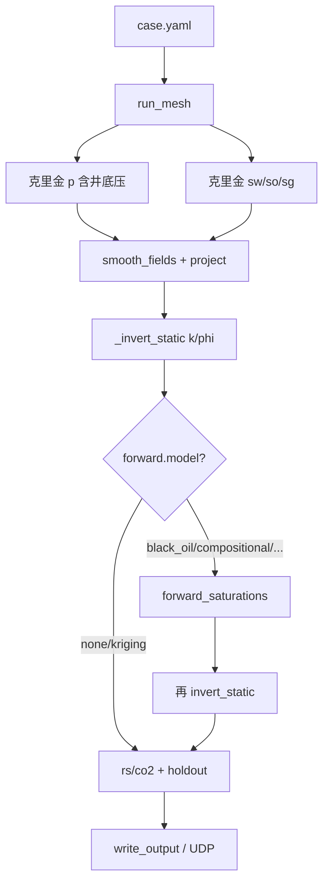

# 08 管线与在线会话

> 模块如何串成一次重构，以及在线长会话如何保持每拍 O(网格数)。对应
> [`pipeline.py`](../../src/programs/pipeline.py)、[`session.py`](../../src/programs/session.py)、
> [`lab_case.py`](../../src/core/lab_case.py)、[`protocol.py`](../../src/programs/protocol.py)。

## 一、`case.yaml` → `LabCase`

[`load_lab_case`](../../src/core/lab_case.py) 读 YAML + CSV，在边界做单位换算，对齐测点/井时序。
`LabCase` 是后面所有程序的唯一样本结构：网格尺寸、测点坐标、井轨迹、观测数组、
`FluidParams`、`WellModelParams`、相似比、`forward_model`、`rock_model`。

在线模式 `require_series=False`：文件里的 `observations`/`series` 可缺，观测只来自 TCP。
`append_step` / `trim_to` 给滑动窗口用。`static_issues` / `series_issues` 在开跑前把坏配置拦下。

字段清单见 [案例库](../案例库.md)。最小例子：[`examples/small/case.yaml`](../../examples/small/case.yaml)。

> **形象化**：`LabCase` 是一张「实验登记表」：岩心多大、插了哪些探针、井在哪、流体什么性质、每一拍读到了什么。
> 后面所有步骤只看这张表，不再碰原始文件——所以单位只在填表时换一次。

## 二、离线管线 `run_pipeline`



1. `run_mesh` → `CartesianGrid` + `PointMap` + `WellMap`（碰撞轴加密）。
2. 每个时刻 `interpolate_pressure_wells`、`interpolate_saturation`。
3. 时间平滑后投影到单纯形。
4. `_invert_static`：`k_homogeneous` 则填常数；`black_oil_3phase` 走三相反演，否则总流度。
5. 前向从合成 \(t=0\)（束缚水初值 + 第一拍井率）积到各报告时刻，丢掉克里金饱和度。
6. 用新饱和度再反演一遍 \(k,\phi\)（定点耦合**一轮**，不是迭代到收敛）。
7. 派出场 \(R_s=r_{\mathrm{slope}} p\)、`co2 = sg + rs*so`；`holdout_probe_errors` 写入诊断。

`write_output` 落 `fields.npz`、npy、csv、json。`summarize_results` 把全场拉回测点/井，供 RESULTS 帧。
CLI：[`src/cli/main.py`](../../src/cli/main.py)。`--model` 覆盖 YAML 的 `forward.model`。

> **形象化：定点耦合**像两个人互相校稿：A（反演）根据 B 的稿子（饱和度）改 \(k\)，B（前向）根据新的 \(k\) 重写饱和度……
> 改到两人都不再改就是「定点」。现在只来回了一次，所以结果是「校过一遍」而不是「定稿」。
>
> **工程直觉**：注意 `co2 = sg + rs*so` 里 `sg` 是储层体积、`rs*so` 是地面体积/储层体积，两者单位不同。
> 这个派生场适合看分布趋势，不要直接拿去和 \(C=S_g/B_g+R_sS_o\) 比数值。

## 三、在线会话：滑动窗口 + 后台反演

朴素做法「每来一拍把历史全部重跑 `run_pipeline`」成本随拍数线性涨，而且反演会堵住 TCP ACK。

[`InversionSession`](../../src/programs/session.py)：

- **窗口恒为 2**（当前 + 上一拍）。`case.trim_to(2)`，插值/平滑/反演/重发都是 O(窗口)，与实验时长无关。
- **增量插值**：只对最新时刻克里金；`_smooth_last` 是 `smooth_fields` 的因果一步，与批处理最后一行相同。
- **反演在后台线程**：`step()` 立刻返回新的 \(p,S\)；\(k,\phi\) 用上一轮完成的结果（latest-wins 合并）。
- `open()` 时用非零占位测值预热 `lu_factor`（约 1.3 s），避免第一拍 ACK 超时。

> **形象化**：前台是收银员（每来一个顾客立刻结账），后台是会计（慢慢对账）。收银员不等会计；
> 会计对完一轮，把最新账本交给收银员，下一个顾客就用新账本。中间来的对账请求只保留最新的一个（latest-wins）。
>
> **工程直觉**：所以在线输出里的 \(k/\phi\) 总是**滞后至少一拍**，而且如果反演比拍间隔慢，会跳过中间的拍。
> 大屏上看到 \(k\) 场「一跳一跳」地更新是正常的。

这与 [联调指南 §7](../联调指南.md)「长会话性能」一致。

## 四、协议设计思想（字节级规范另文）

| 方向 | 传输 | 为什么 |
|---|---|---|
| 采集 → 后端 | TCP，长度前缀帧 | 测点/注采不能丢、要 ACK/NAK |
| 后端 → 仪表盘 | UDP，带 `stream_id`+序号+CRC32 | 全场数组大、允许丢包后 RESEND |

魔术 `"RB"`，`PROTOCOL_VERSION=2`，小端。TCP 消息：HELLO / READY / STEP / ACK / NAK / BYE。
UDP：MANIFEST / FIELD / RESULTS / END。控制口可选，答 RESEND。
单元排序必须是 `k*ny*nx + j*nx + i`。逐字节布局见 [接口协议](../接口协议.md)；怎么开终端见 [联调指南](../联调指南.md)。

> **形象化**：TCP 是挂号信（签收了才算），UDP 是广播（发出去不管收没收到，但每张传单有编号和校验码，缺了可以要求重发）。
> 输入少而关键用挂号信，输出大而可重算用广播。
>
> **工程直觉**：15³ 格、7 个场、float64，一拍约 \(3375\times7\times8\approx 190\) KB，要切成上百个 UDP 包。
> 丢一个包整个场就不完整，所以 END 帧里带总包数和整体 CRC。

## 五、相似换算的物理意义

实验室 0.30 m 立方对应矿场几百米。几何比 \(\lambda_x=L_p/0.30\) 等，体积比 \(C_V=\lambda_x\lambda_y\lambda_z\)。
**等线速度** \(v_p=v_m\) ⇒ 时间比 \(C_t=C_{L_c}\)（代表注采距离比）。流量比 \(C_{q_V}=C_V/C_{L_c}\)。
公式与输入表见 [相似换算](../相似换算.md)，代码 [`similarity.py`](../../src/programs/similarity.py)。
本模块**不做** CO₂ 的标准态/储层态 EOS 换算；`volume_basis` 只要求输入输出同一基准。

> **工程直觉**：等线速度相似只保证「流体走同样距离所用时间按长度缩放」，不保证压力扩散、重力分异、毛管力也按同样比例缩放。
> 第 01 章算过，压力扩散时间 \(\propto L^2\)，放大 1000 倍长度就放大 \(10^6\) 倍时间，而等线速度只放大 1000 倍。
> 所以实验室「准稳态」的结论不能直接搬到矿场。

## 六、代码对照

| 概念 | 位置 |
|---|---|
| YAML 解析 | `lab_case_from_mapping`、`load_lab_case` |
| 离线编排 | `run_pipeline`、`write_output` |
| 在线 | `InversionSession.step` |
| TCP 服务 | `input_tcp.serve` |
| UDP 发布 | `udp.publish_fields` |
| 帧编解码 | `protocol.py` |
| 相似比 | `similarity_ratios`、`field_scale_view` |
| 井/测点摘要 | `results.summarize_results` |

## 七、小练习

```python
from src.core.lab_case import load_lab_case, summarize_lab_case
from src.programs.similarity import similarity_ratios
from src.programs.pipeline import run_mesh

case = load_lab_case("examples/small/case.yaml")
info = summarize_lab_case(case)
print(info["nx"], info["n_probes"], info["n_wells"], info["n_times"], info["forward_model"])

mesh = run_mesh(case)
print("grid", mesh.grid.nx, mesh.grid.ny, mesh.grid.nz, "cells", mesh.grid.n_cells)
print("first probe cell", int(mesh.probes.cell[0]), "ijk", mesh.grid.ijk(int(mesh.probes.cell[0])))

r = similarity_ratios(300.0, 300.0, 30.0, 150.0, model_flow_path_m=0.15)
print("lambda_x, c_v, c_t, c_qv =", r["lambda_x"], r["c_v"], r["c_t"], r["c_qv"])
```

\(\lambda_x=\lambda_y=1000\)，\(\lambda_z=100\)，\(C_V=10^8\)；路径比 \(150/0.15=1000=C_t\)；流量比 \(C_V/C_t=10^5\)。

## 八、章末测试题

**1.** 离线管线里 \(k/\phi\) 反演跑几次？为什么不是一次？

<details><summary>答案与解析</summary>

开启前向时两次：先用克里金饱和度反演一次（前向需要 \(k,\phi\)），前向算出守恒的饱和度后再反演一次，让 \(k\) 与羽流一致。
`forward.model: none` 时只跑一次。

</details>

**2.** 在线会话的窗口是 2。实验跑了 1000 拍，每拍的插值成本和第 2 拍相比如何？

<details><summary>答案与解析</summary>

一样。窗口固定为 2，插值只对最新一拍做，成本 O(网格数)，与已跑的拍数无关。朴素实现第 1000 拍要处理 1000 拍历史。

</details>

**3.** 后台反演每轮要 5 秒，采集端每 1 秒发一拍。第 10 拍返回的 \(k\) 大约是用哪一拍的数据算的？

<details><summary>答案与解析</summary>

大约是 5 秒前开始的那一轮，即第 4–5 拍左右的数据；期间到达的反演请求被合并成「最新一个」。
\(k\) 滞后约 5 拍，且只每 5 秒更新一次。

</details>

**4.** 为什么输入用 TCP、输出用 UDP？反过来会怎样？

<details><summary>答案与解析</summary>

输入是测点和注采量，丢一拍会让反演用错数据，必须可靠且有应答；输出是可以重算的大数组，UDP 延迟低、一对多方便，丢包可检测后重发。
反过来：输出用 TCP 时大屏卡顿会反压后端；输入用 UDP 时丢拍无法察觉。

</details>

**5.** 一拍 15³ 网格、7 个 float64 场的数据量大约多少？

<details><summary>答案与解析</summary>

\(3375\times7\times8\approx 1.9\times10^5\) 字节 ≈ 190 KB。以 1400 字节左右一个 UDP 包算，要一百多个包。

</details>

**6.** 按 `small` 案例的相似比，实验室 1 分钟对应矿场多久？实验室 1 mL/min 对应矿场多少 m³/d？

<details><summary>答案与解析</summary>

\(C_t=1000\)：1 min → 1000 min ≈ 0.69 天。\(C_{q_V}=10^5\)：1 mL/min \(=1.44\times10^{-3}\) m³/d，乘 \(10^5\) 得 144 m³/d。

</details>

**7.** 判断：「实验室里压力 1–6 分钟就平衡，所以矿场上压力也几乎瞬时平衡。」

<details><summary>答案与解析</summary>

错。压力扩散时间 \(\propto L^2/k\)。长度放大 1000 倍、渗透率相同时，扩散时间放大 \(10^6\) 倍，从 1.5–6 分钟变成约 3–11 年。
等线速度相似律只让时间按 \(L\) 放大，不覆盖扩散过程。

</details>

## 九、延伸阅读

- [接口协议](../接口协议.md)、[联调指南](../联调指南.md)
- [案例库](../案例库.md)
- 下一篇：[09-验证与精度](09-验证与精度.md)
